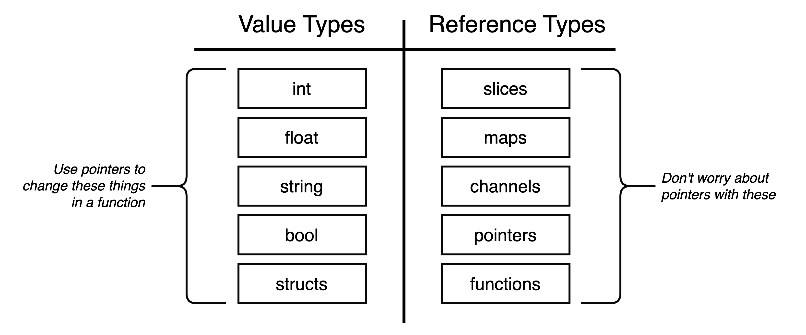
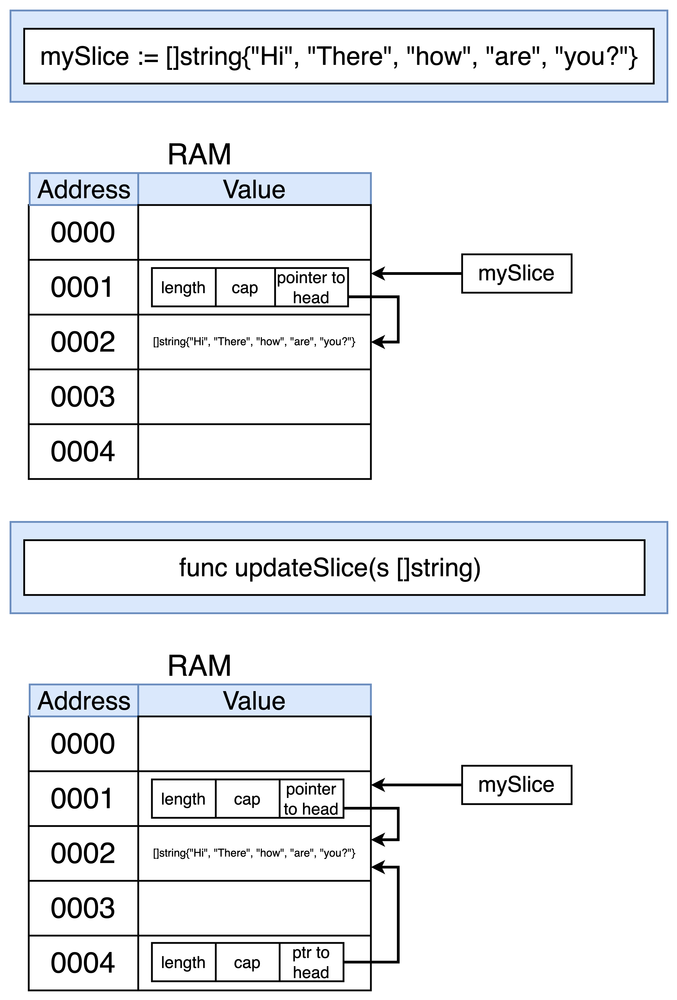

### structs


--------------
### `&variable` and `*pointer`

In Go, `&variable` and `*pointer` are related to how you work with pointers and values:

1. **`&variable`**:
   - This syntax is used to get the memory address of a variable in Go.
   - It returns a pointer to the variable's memory address.
   - This is also known as the "address of" operator.

   Example:
   ```go
   package main

   import "fmt"

   func main() {
       x := 10
       fmt.Println("Value of x:", x)     // Output: Value of x: 10
       fmt.Println("Address of x:", &x)  // Output: Address of x: 0xc0000140a8 (example address)
   }
   ```

   In this example, `&x` gives the memory address where the variable `x` is stored.

2. **`*pointer`**:
   - This syntax is used to dereference a pointer in Go.
   - It retrieves the value that the pointer points to.

   Example:
   ```go
   package main

   import "fmt"

   func main() {
       x := 10
       ptr := &x         // ptr is a pointer to x
       fmt.Println(*ptr) // Output: 10 (value at the memory address stored in ptr)
   }
   ```

   Here, `*ptr` retrieves the value stored at the memory address stored in `ptr`.

### Key Differences:
- `&variable` gives you the memory address of a variable.
- `*pointer` gives you the value stored at the memory address pointed to by `pointer`.

### When to Use:
- **`&variable`**: Use when you need to pass a variable's address to a function or store it for later use, especially when you want to modify the original variable within a function.
  
- **`*pointer`**: Use when you have a pointer and want to access or modify the value it points to.

In Go, understanding pointers and their usage (`&variable` and `*pointer`) is crucial for managing memory efficiently and for implementing certain advanced patterns such as data structures or when working with functions that need to modify variables indirectly.

--------------
### reference vs. value types


When we create a slice, Go will automatically create which 2 data structures: `an array` and `a structure that records the length of the slice, the capacity of the slice, and a reference to the underlying way`.



Why the Addresses Are Different:
- When you print `&namePointer` in `main()`, it prints the memory address where `namePointer` itself (the variable) is stored.
- When you print `&namePointer` in `printPointer()`, it prints the memory address of the namePointer parameter received by the function.
Since `namePointer` is a local variable in `main()` and `printPointer()` respectively, they each have their own memory addresses. The memory address of namePointer in `main()` and the memory address of namePointer in `printPointer()` are not the same because they refer to different instances of the pointer variable in their respective scopes.

Therefore, the memory addresses printed by both Println calls will be different. Each &namePointer refers to the memory location where that specific namePointer variable is stored in its respective function scope.